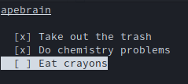

Apebrain
===
A simple vim-like todo app, right in your terminal.

Building apebrain from source (full installation has yet to come)
---
NOTE: Make sure `cmake`, `make`, `ncurses-devel` and `jsoncpp-devel` (or their distro-specific equivalents) are installed.

1. `git clone https://github.com/turtlebasket/apebrain`
2. `cd apebrain`
3. `cmake .`
4. `make`
5. `./apebrain`

The Todo-list for the Todo-list
---
- [x] `ncurses` interface with vim-style and arrow-key bindings
- [x] Simple task tracking using `std::vector`
- [x] Serialized task storage (text files)
- [x] Moving/reordering tasks
- [x] Adding tasks
- [x] Deleting tasks
- [ ] Universal confirmation dialog for deleting (unticked)/clearing (ticked) tasks
- [ ] JSON-based storage; current serialization system makes me weep blood
- [ ] User-defined task types & corresponding order of color codes (Work, break, etc)
- [ ] Multi-list management system (tabs? TBD)
- [ ] Help/shortcut page
- [ ] Long/short-term prioritization
- [ ] Calendar/Scheduling Panel
